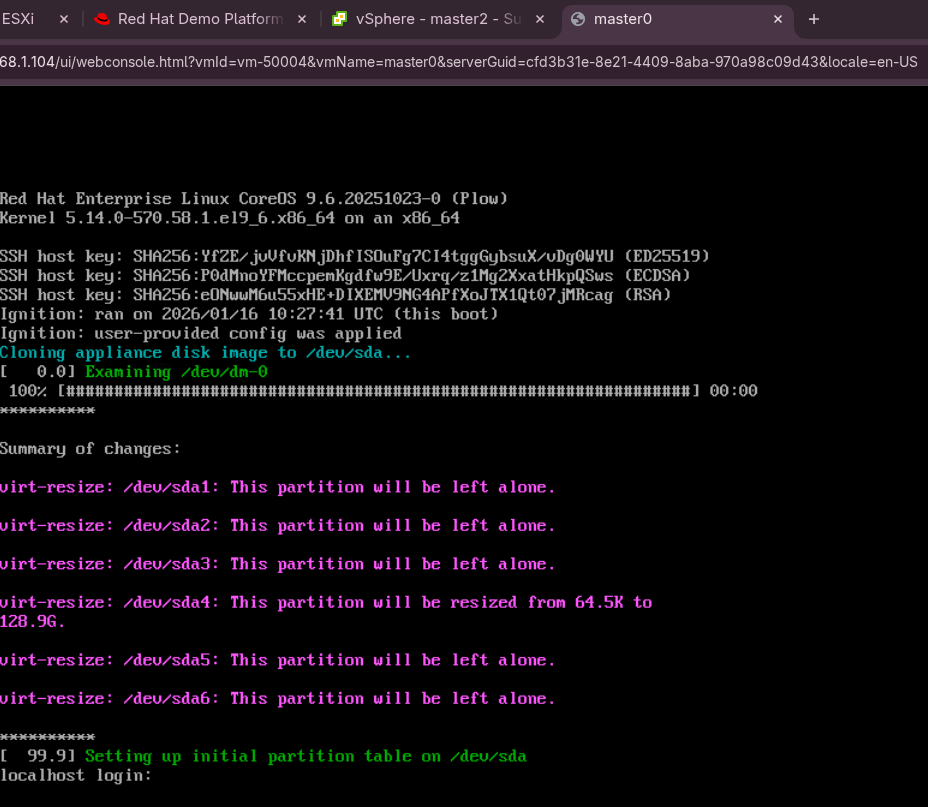
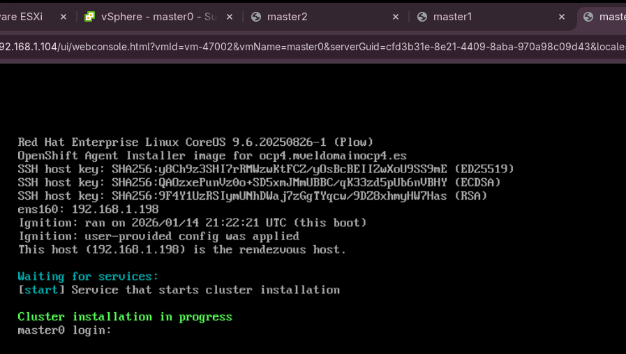
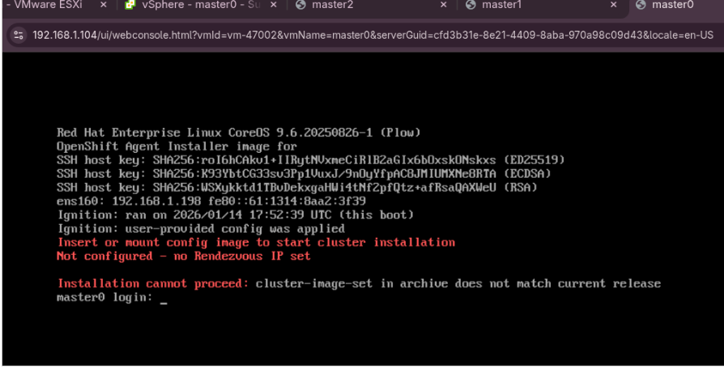

# Deploy OpenShift cluster in VSphere using OpenShift Appliance Builder


# Disclaimer
This content has not been tested on every configuration.


# Purpose  
This repo document how to build and deploy a three-node OpenShift cluster on VMware vSphere using the **OpenShift Appliance Builder**, usinf static IPs.  
This repository provides an example workflow (not production-ready) for delivering an Agent-Based Installer image and cluster configuration ISO.

# :warning: Important Notice
The OpenShift Appliance Builder is currently **Technology Preview** and **not supported for production use**.  
Do **not** rely on this method for production OpenShift clusters.

---

# Overview

OpenShift Appliance Builder creates a **self-contained image** that embeds the OpenShift release, an internal registry, the Red Hat installer, and all required assets into a single disk image (RAW or ISO).  
This enables installations without requiring access to external registries.

This repo demonstrates:
- Creating VSphere Virtual Machines
- Generate the Base RAW disk image and ISO disk image 
- Generate the Config ISO Image
- Install OpenShift in the Virtual Machines

---

# Prerequisites

## Environment
- vSphere environment with sufficient compute, storage, and networking  
- DNS records pointing to cluster APIs and APPs  
- Local workstation with Podman available for appliance build  
- Access to Red Hat pull secret (for connected installation)

## DNS Requirements

DNS records for:
- `api.<cluster-domain>`
- `*.apps.<cluster-domain>`

## Install nmstate in the Laptop were you will build the Base Config ISO
This is required to build the config ISO, using static IP in agent-config.yaml.

In RHEL: 
```sh
sudo dnf install nmstate
```

## Set Enviremont Vars
```sh
#To login with GOVC with VCENTER
export GOVC_URL='192.168.1.104'
export GOVC_USERNAME='administrator@vsphere.local'
export GOVC_PASSWORD="$(< /home/lmartinh/.passwords/vcenter)"
export GOVC_INSECURE=1

#Vars used to save VMs NIC MAC Address - these vars will be set after VMs creation
export MAC_MASTER0
export MAC_MASTER1
export MAC_MASTER2

#Pull Secret Red Hat image registries
export PULL_SECRET="$(< /home/lmartinh/.passwords/pull-secret.yaml)"
export SSH_KEY="$(< ~/.ssh/id_rsa.pub)"
export VSPHERE_OCP_FOLDER="/datacenter1/vm/ocp4"

export OCP_INSTALL_VERSION='4.19.21'
```

# Creating VSphere Virtual Machines

Before installation, create three VMs and enable `disk.EnableUUID=TRUE` (required for OpenShift installation).

Example with `govc`:

## Create VMs

**Master0**

Mind: The RendevousIP node, in my case Master0, will host the bootstrap node, that will be used to create the OpenShift cluster.
 
```sh
govc vm.create \
  -folder "${VSPHERE_OCP_FOLDER}" \
  -ds "datastore7" \
  -net "VM Network" \
  -net.adapter vmxnet3 \
  -disk 200G \
  -disk.thick=false \
  -m 20000 \
  -c 5 \
  -g "rhel9_64Guest" \
  -on=false \
  "master0"
```

**Master 1**

```sh
govc vm.create \
  -folder "${VSPHERE_OCP_FOLDER}" \
  -ds "datastore7" \
  -net "VM Network" \
  -net.adapter vmxnet3 \
  -disk 200G \
  -disk.thick=false \
  -m 20000 \
  -c 5 \
  -g "rhel9_64Guest" \
  -on=false \
  "master1"
```

**Master 2**

```sh
govc vm.create \
  -folder "${VSPHERE_OCP_FOLDER}" \
  -ds "datastore7" \
  -net "VM Network" \
  -net.adapter vmxnet3 \
  -disk 200G \
  -disk.thick=false \
  -m 20000 \
  -c 5 \
  -g "rhel9_64Guest" \
  -on=false \
  "master2"
```

## Configure VMs

* Add CDROM to the VMs

  ```sh
  govc device.cdrom.add -vm "master0"
  govc device.cdrom.add -vm "master1"
  govc device.cdrom.add -vm "master2"
  ```

* Set disk.EnableUUID = TRUE 

  ```sh
  govc vm.change -vm master0 -e disk.EnableUUID=TRUE
  govc vm.change -vm master1 -e disk.EnableUUID=TRUE
  govc vm.change -vm master2 -e disk.EnableUUID=TRUE

  #Confirm configuration:
  govc vm.info -e master0 | grep -i enableuuid
  govc vm.info -e master1 | grep -i enableuuid
  govc vm.info -e master2 | grep -i enableuuid
  ```


## Note the MACs assigned

Record the NIC MAC addresses assigned to each VM/Node — these are needed in the Agent config to configure the agent-config.yaml

```sh
export MAC_MASTER0=`govc vm.info -json master0 | \
jq -r '.virtualMachines[]
       | .config.hardware.device[]?
       | select(.macAddress? != null)
       | .macAddress'`

export MAC_MASTER1=`govc vm.info -json master1 | \
jq -r '.virtualMachines[]
       | .config.hardware.device[]?
       | select(.macAddress? != null)
       | .macAddress'`

export MAC_MASTER2=`govc vm.info -json master2 | \
jq -r '.virtualMachines[]
       | .config.hardware.device[]?
       | select(.macAddress? != null)
       | .macAddress'`

echo "${MAC_MASTER0}--${MAC_MASTER1}--${MAC_MASTER2}"
```


# Generate the Base RAW disk image

## Set Enviremont Variables

```sh
#image of the openshift-appliance RAW and ISO builder
export APPLIANCE_IMAGE="quay.io/edge-infrastructure/openshift-appliance:latest"

export APPLIANCE_ASSETS="/home/test/appliance_assets"
```

## Create assets path
```sh
mkdir -p ${APPLIANCE_ASSETS}
cd ${APPLIANCE_ASSETS}
```


## Generate a template of the appliance config
This will generate the appliance-config.yaml file, which contains all the configurable options. 

```sh
podman run --rm -it --pull newer -v $APPLIANCE_ASSETS:/assets:Z $APPLIANCE_IMAGE generate-config
  ```
Result:
```sh
INFO Generated config file in assets directory: appliance-config.yaml
```

## Configure the `appliance-config.yaml`
The appliance-config.yaml allows multiple parameters to be configured based on your needs. I will only use a subset of the parameters as per my requirements

Modify the `appliance-config.yaml` to the following, adapt it to your needs:
* Backup generated file
    ```sh
    mv appliance-config.yaml appliance-config.yaml.original-generated
    ```

* Configure file to my specific needs

    ```sh
    cat <<EOF > appliance-config.yaml
    apiVersion: v1beta1
    kind: ApplianceConfig
    ocpRelease:
      version: ${OCP_INSTALL_VERSION}
      channel: stable
      cpuArchitecture: x86_64
    #Commented the diskSize because I will use the Base ISO instead of the Base RAW image disk - 
    #- in such case will decrease by a lot the Base ISO size 
    #diskSizeGB: 150
    pullSecret: '${PULL_SECRET}'
    sshKey: "${SSH_KEY}"
    EOF
    ```


**NOTE:** 
- This demo uses a connected OpenShift cluster. As a result, Day-2 operations will rely on public Red Hat image registries. For this reason, the **pullSecret** is configured with valid authentication tokens to access Red Hat public registries.
The pull secret can be obtained from https://console.redhat.com/openshift/install/pull-secret
- It is possible to add the `appliance-config` custom manifests, install operators in Day1 or add custom images in Day1, though for this demo I have not configured any of this features. For more details check the [user manual](https://github.com/openshift/appliance/blob/master/docs/user-guide.md).


## Clean folders in case of rebuilding appliance 

Run:
```sh
sudo podman run --rm -it -v $APPLIANCE_ASSETS:/assets:Z $APPLIANCE_IMAGE clean
```


## Build the Base RAW disk image
- Ensure sufficient free disk space is available.
  - The required space is determined by the configured diskSizeGB value (minimum 150 GiB) defined earlier.
  - When using the Base ISO instead of the Base RAW disk image, the diskSizeGB parameter does not need to be configured, which reduces local storage consumption.
- The image build process may take several minutes; more than 20 GB of data will be downloaded from the internet.
- The --privileged option is required because the openshift-appliance container uses guestfish to build the disk image.
- The --net=host option is required because the openshift-appliance container relies on host networking for the internal image registry container started during the build process.

Run:
```shell
sudo podman run --rm -it --pull newer --privileged --net=host -v $APPLIANCE_ASSETS:/assets:Z $APPLIANCE_IMAGE build
```

* Output:
    ```sh
    sudo podman run --rm -it --pull newer --privileged --net=host -v $APPLIANCE_ASSETS:/assets:Z $APPLIANCE_IMAGE build

    INFO Successfully downloaded appliance base disk image 
    INFO Successfully extracted appliance base disk image 
    | Generating container registry image...INFO Registry image URI: localhost/registry:latest 
    INFO Successfully generated container registry image 
    INFO Successfully pulled OpenShift 4.19.21 release images required for installation 
    INFO Successfully generated data ISO              
    INFO Successfully fetched openshift-install binary 
    INFO Successfully downloaded CoreOS ISO           
    INFO Successfully generated recovery CoreOS ISO   
    INFO Successfully generated appliance disk image  
    INFO Time elapsed: 31m17s                         
    INFO                                              
    INFO Appliance disk image was successfully created in the 'assets' directory: appliance.raw 
    INFO                                              
    INFO Create configuration ISO using: openshift-install agent create config-image 
    INFO Copy openshift-install from: assets/cache/4.19.21-x86_64/openshift-install 
    INFO Download openshift-install from: https://mirror.openshift.com/pub/openshift-v4/x86_64/clients/ocp/4.19.21/openshift-install-linux.tar.gz 
    ```

    ```sh
    pwd
    /home/test/appliance_assets

    ls
    appliance-config.yaml  appliance.raw  cache  temp
    ```

## Generate the Base ISO disk image - from the Base RAW image disk
- This step is optional, as the Base RAW image is sufficient to install the operating system on the virtual machines.
- Tough using a Base ISO image provides some advantages:
  - The image does not need to be resized.
  - The ISO can be mounted directly using the VM virtual media.
  - No additional devices (such as a USB drive) are required to write or clone the Base RAW image.

* Create script file and customize it to your needs - this script is invoked on completion of the OS installation

    Run:
    ```sh
    cat <<EOF > post_deployment_script.sh
    #!/bin/bash

    echo restart the machine...
    shutdown -h 0
    EOF
    ```

* Create Base ISO from the Base RAW disk image

    Run:
    ```sh
    sudo podman run --rm -it --privileged -v $APPLIANCE_ASSETS:/assets:Z $APPLIANCE_IMAGE build iso --target-device /dev/sda --post-script post_deployment_script.sh
    ```

    * Output:
        ```sh
        sudo podman run --rm -it --privileged -v $APPLIANCE_ASSETS:/assets:Z $APPLIANCE_IMAGE build iso --target-device /dev/sda --post-script post_deployment_script.sh
        INFO Successfully copied appliance disk image     
        INFO Successfully pulled appliance container image 
        INFO Successfully generated appliance deployment ISO 
        INFO                                              
        INFO Appliance deployment ISO is available in the 'assets' directory: appliance.iso 
        INFO Boot a machine from the ISO to initiate the deployment 
        ```

        ```sh
        pwd
        /home/test/appliance_assets

        ls
        appliance-config.yaml  appliance.iso  appliance.raw  cache  post_deployment_script.sh  temp
        ```


# Generate the Config ISO Image
* The config ISO will contain the manifests generated as part of the install-config.yaml and agent-config.yaml configuration.

* I will install a three node OpenShift cluster, so each Master will have the role of Master and Worker.


## Create config yamls manifests
Refer to the official ABI documentation for more details: [Installing an OpenShift Container Platform cluster with the Agent-based Installer](https://docs.openshift.com/container-platform/4.17/installing/installing_with_agent_based_installer/installing-with-agent-based-installer.html)

* Create a configuration directory
  
  **:warning: Use absolute directory paths.**
  ```shell
  export CLUSTER_CONFIG=/home/test/cluster_config
  mkdir -p $CLUSTER_CONFIG
  cd $CLUSTER_CONFIG
  ```

* Create `install-config.yaml` manifest

    * Create install-config.yaml
        ```sh 
        cat <<EOF > install-config.yaml
        apiVersion: v1
        baseDomain: "mveldomainocp4.es"
        compute:
        - architecture: amd64 
          hyperthreading: Enabled
          name: worker
          replicas: 0
        controlPlane:
          architecture: amd64
          hyperthreading: Enabled
          name: master
          replicas: 3
        metadata:
          name: "ocp4"
        networking:
          clusterNetwork:
          - cidr: 10.128.0.0/14
            hostPrefix: 23
          machineNetwork:
          - cidr: "192.168.1.0/24"
          networkType: OVNKubernetes 
          serviceNetwork:
          - 172.30.0.0/16
        platform:
          vsphere:
            apiVIP: 192.168.1.201
            ingressVIP: 192.168.1.202
            failureDomains:
            - name: failure-domain-ocp4
              region: region-ocp4
              server: ${GOVC_URL}
              topology:
                computeCluster: "/datacenter1/host/cluster1"
                datacenter: datacenter1
                datastore: "/datacenter1/datastore/datastore7"
                networks:
                - VM Network
        #        resourcePool: "/datacenter1/host/cluster1/Resources/"
                folder: ${VSPHERE_OCP_FOLDER}
              zone: zone-ocp4
            vcenters:
            - datacenters:
              - datacenter1
              password: '${GOVC_PASSWORD}'
              port: 443
              server: ${GOVC_URL}
              user: ${GOVC_USERNAME}
            diskType: thin
        pullSecret: '${PULL_SECRET}'
        sshKey: "${SSH_KEY}"
        EOF
        ```

* Create `agent-config.yaml`.

    * Set env vars
        ```sh
        export DNS_SERVER_IP=192.168.1.152
        export DF_GW_IP=192.168.1.1
        ```

    * Create the agent-config.yaml
        ```sh 
        cat <<EOF > agent-config.yaml
        apiVersion: v1beta1
        kind: AgentConfig
        metadata:
          name: "ocp4"
        rendezvousIP: "192.168.1.198"
        hosts:
          - hostname: master0
            interfaces:
              - name: ens160
                macAddress: ${MAC_MASTER0}
            networkConfig:
              interfaces:
                - name: ens160
                  type: ethernet
                  state: up
                  mac-address: ${MAC_MASTER0}
                  ipv4:
                    enabled: true
                    address:
                      - ip: 192.168.1.198
                        prefix-length: 24
                    dhcp: false
              dns-resolver:
                config:
                  server:
                    - ${DNS_SERVER_IP}
              routes:
                config:
                  - destination: 0.0.0.0/0
                    next-hop-address: ${DF_GW_IP}
                    next-hop-interface: ens160
                    table-id: 254
          - hostname: master1
            interfaces:
              - name: ens160
                macAddress: ${MAC_MASTER1}
            networkConfig:
              interfaces:
                - name: ens160
                  type: ethernet
                  state: up
                  mac-address: ${MAC_MASTER1}
                  ipv4:
                    enabled: true
                    address:
                      - ip: 192.168.1.197
                        prefix-length: 24
                    dhcp: false
              dns-resolver:
                config:
                  server:
                    - ${DNS_SERVER_IP}
              routes:
                config:
                  - destination: 0.0.0.0/0
                    next-hop-address: ${DF_GW_IP}
                    next-hop-interface: ens160
                    table-id: 254
          - hostname: master2
            interfaces:
              - name: ens160
                macAddress: ${MAC_MASTER2}
            networkConfig:
              interfaces:
                - name: ens160
                  type: ethernet
                  state: up
                  mac-address: ${MAC_MASTER2}
                  ipv4:
                    enabled: true
                    address:
                      - ip: 192.168.1.196
                        prefix-length: 24
                    dhcp: false
              dns-resolver:
                config:
                  server:
                    - ${DNS_SERVER_IP}
              routes:
                config:
                  - destination: 0.0.0.0/0
                    next-hop-address: ${DF_GW_IP}
                    next-hop-interface: ens160
                    table-id: 254
        EOF
        ```

    **Notes:**
    - rendezvousIP: IP address of the node selected to act as the rendezvous (bootstrap) host for the cluster installation.
    - pullSecret: Authentication data used by the installer to pull container images from the configured registries.
    - MAC address: The MAC address specified for each host must match exactly the MAC address of the corresponding VM network interface.
    - SSH public key: The SSH public key for the core user can be specified in install-config.yaml under the sshKey field. This key allows SSH access to the nodes after the cluster installation completes.

## Backup the agent-config.yaml and install-config.yaml

  ```sh
  export CLUSTER_CONFIG=/home/test/cluster_config
  mkdir -p $CLUSTER_CONFIG/backup_manifests
  cp install-config.yaml $CLUSTER_CONFIG/backup_manifests
  cp agent-config.yaml $CLUSTER_CONFIG/backup_manifests
  ```

## Create the Base Config ISO

  :warning: The following command will delete the `install-config.yaml` and `agent-config.yaml` files - back them up first.

  ```shell
  ${APPLIANCE_ASSETS}/cache/${OCP_INSTALL_VERSION}-x86_64/openshift-install agent create config-image --dir $CLUSTER_CONFIG
  ```

The content of `cluster_config` directory should be
  ```shell
  ├── agentconfig.noarch.iso
  ├── auth
  │   ├── kubeadmin-password
  │   └── kubeconfig
  ```

**Notes:** 
- The config ISO contains configurations and **cannot** be used as a bootable ISO.
- Make sure to use the *openshift-install* binary on the OpenShift version that you want to install.


# Upload both ISOs (Base and Config) to VMWARE Datastore

```sh
scp agentconfig.noarch.iso <vmware_user>@<vmware_ip>:<path>
scp appliance.iso <vmware_user>@<vmware_ip>:<path>

Example:
  scp $CLUSTER_CONFIG/agentconfig.noarch.iso root@192.168.1.103:/vmfs/volumes/datastore7/iso
  scp $APPLIANCE_ASSETS/appliance.iso root@192.168.1.103:/vmfs/volumes/datastore7/iso
```

# Clone Base ISO disk image to the Virtual Machine Disk

- Mount the Base ISO on the Virtual Media (in this case CDROM) of all three Virtual Machines.

    Note: If you prefer, instead of using the Base ISO you can use the Base RAW image wich should been burned into a USB stick in advanced (not documented in this repo ).

    ```sh
    govc device.cdrom.insert -vm "master0" -device "cdrom-3000" -ds datastore7 "iso/appliance.iso"
    govc device.cdrom.insert -vm "master1" -device "cdrom-3000" -ds datastore7 "iso/appliance.iso"
    govc device.cdrom.insert -vm "master2" -device "cdrom-3000" -ds datastore7 "iso/appliance.iso"
    ```

- Power on the Virtual Machines
    In this step the Operating System (OS) will boot from the ISO

    ```sh
    govc vm.power -on "master0"
    govc vm.power -on "master1"
    govc vm.power -on "master2"
    ```

- Screenshot: Disks getting cloned

  

Once the OS is cloned the Post Script will kick in and shutdown the VMs/Nodes.


# Install OpenShift in the Virtual Machines

Unmount the Base ISO and mount the Config ISO.
In this setup, VMware did not allow unmounting the Base ISO and mounting the Config ISO while the virtual machines were powered on.
As a workaround, the VMs were powered off, the Base ISO was unmounted, and the Config ISO was mounted instead.

The steps are as follows:

1. Power down VMs
    ```sh
    govc vm.power -off "master0"
    govc vm.power -off "master1"
    govc vm.power -off "master2"
    ```

1. Umount Base ISO
    ```sh
    govc device.cdrom.eject -vm master0 "cdrom-3000"
    govc device.cdrom.eject -vm master1 "cdrom-3000"
    govc device.cdrom.eject -vm master2 "cdrom-3000"
    ```

1. Mount Config ISO
    ```sh
    govc device.cdrom.insert -vm "master0" -device "cdrom-3000" "iso/agentconfig.noarch.iso"
    govc device.cdrom.insert -vm "master1" -device "cdrom-3000" "iso/agentconfig.noarch.iso"
    govc device.cdrom.insert -vm "master2" -device "cdrom-3000" "iso/agentconfig.noarch.iso"
    ```

1. Power on Virtual Machines
    ```sh
    govc vm.power -on "master0"
    govc vm.power -on "master1"
    govc vm.power -on "master2"
    ```

1. Once the nodes are powered on the mounted Config ISO will be loaded and the OpenShift installation will start:

    When the installation starts the RendevourIP node will show "Cluster installation in progress"

    

1. You can followup the installation using the command

    ```sh
    ${APPLIANCE_ASSETS}/cache/${OCP_INSTALL_VERSION}-x86_64/openshift-install --dir $CLUSTER_CONFIG agent wait-for bootstrap-complete

    ${APPLIANCE_ASSETS}/cache/${OCP_INSTALL_VERSION}-x86_64/openshift-install --dir $CLUSTER_CONFIG agent wait-for install-complete
    ```

1. Check that the installation is completed

    ```sh
    export KUBECONFIG=${CLUSTER_CONFIG}/auth/kubeconfig

    oc get clusterversion
    oc get clusteroperator
    ```

# Day2 Configurations

## Configure Cataloge to use the Red Hat Image Registries
By default, the OpenShift Appliance Builder disables the OperatorHub.
To enable it, the following configuration can be applied. This allows operators managed by OLM to be installed.
In this case, the public Red Hat image registries are used.

Enable catalog:
```sh
oc patch OperatorHub cluster --type json -p '[{"op": "add", "path": "/spec/disableAllDefaultSources", "value": false}]'
```


# Troubleshoot

## How to capture the ABI Agent Installation Logs

Installing on vSphere with Agent-based installer fails with bootstrap process timed out 
https://access.redhat.com/solutions/7061423

Collect logs from the RendevousIP node using the agent-gather tool and extract the files:

```sh
ssh core@<RENDEVOUS_IP> -i ~/.ssh/id_....
mkdir -p /tmp/r
cd /tmp/r
sudo /usr/local/bin/agent-gather -O > agent-gather.tar.xz
tar -xf agent-gather.tar.xz

#Convert journal logs to readable files:
cd agent-gather
mkdir journal
cat journal.export | /usr/lib/systemd/systemd-journal-remote -o journal/node-0.journal -
cd journal
journalctl --file node-0.journal > jnl.log
cat jnl.log
```


## ABI was failing with error: Fails Due to Insufficient Disk Space on control node 

As a temporary workaround, increase the memory of the rendezvous node to at least 18GB to allow the installation to complete. 
https://access.redhat.com/solutions/7133039


## Error when trying to load the config ISO: “installation cannot proceed: cluster-image-set in archive does not match current release”



This error was related to using the wrong version of openshift-install, used version 4.2.8 whereas the correct sgould have been 4.19.12.

The following was the error in the rendovousIP Master0:

```sh
ssh core@192.168.1.198 -i ~/.ssh/id_rsa 

[core@master0 ~]$
[core@master0 ~]$ sudo systemctl status load-config-iso@-dev-sr0.service 
● load-config-iso@-dev-sr0.service - If a config ISO is mounted, copy its files to the system
     Loaded: loaded (/etc/systemd/system/load-config-iso@.service; disabled; preset: disabled)
     Active: activating (start) since Wed 2026-01-14 17:52:55 UTC; 2min 11s ago
   Main PID: 2037 (load-config-iso)
      Tasks: 2 (limit: 101632)
     Memory: 1.8M
        CPU: 1.205s
     CGroup: /system.slice/system-load\x2dconfig\x2diso.slice/load-config-iso@-dev-sr0.service
             ├─2037 /bin/bash /usr/local/bin/load-config-iso.sh /dev/sr0
             └─2732 sleep 5

Jan 14 17:55:06 master0.ocp4.mveldomainocp4.es load-config-iso.sh[2721]: 5c5
Jan 14 17:55:06 master0.ocp4.mveldomainocp4.es load-config-iso.sh[2721]: <   name: openshift-4.19.16
Jan 14 17:55:06 master0.ocp4.mveldomainocp4.es load-config-iso.sh[2721]: ---
Jan 14 17:55:06 master0.ocp4.mveldomainocp4.es load-config-iso.sh[2721]: >   name: openshift-4.20.8
Jan 14 17:55:06 master0.ocp4.mveldomainocp4.es load-config-iso.sh[2721]: 7c7
Jan 14 17:55:06 master0.ocp4.mveldomainocp4.es load-config-iso.sh[2721]: <   releaseImage: quay.io/openshift-release-dev/ocp-release@sha256:8f57c0a381695f49c15e4b337f0259a02de2cfa10be3882a6>
Jan 14 17:55:06 master0.ocp4.mveldomainocp4.es load-config-iso.sh[2721]: ---
Jan 14 17:55:06 master0.ocp4.mveldomainocp4.es load-config-iso.sh[2721]: >   releaseImage: quay.io/openshift-release-dev/ocp-release@sha256:91606a5f04331ed3293f71034d4f480e38645560534805fe5>
Jan 14 17:55:06 master0.ocp4.mveldomainocp4.es load-config-iso.sh[2037]: The cluster-image-set in archive does not match current release quay.io/openshift-release-dev/ocp-release@sha256:8f5>
Jan 14 17:55:07 master0.ocp4.mveldomainocp4.es load-config-iso.sh[2037]: Retrying to copy contents from /media/config-image/config.gz
```

# Reference Links
OpenShift Appliance User Guide
https://github.com/openshift/appliance/blob/master/docs/user-guide.md
